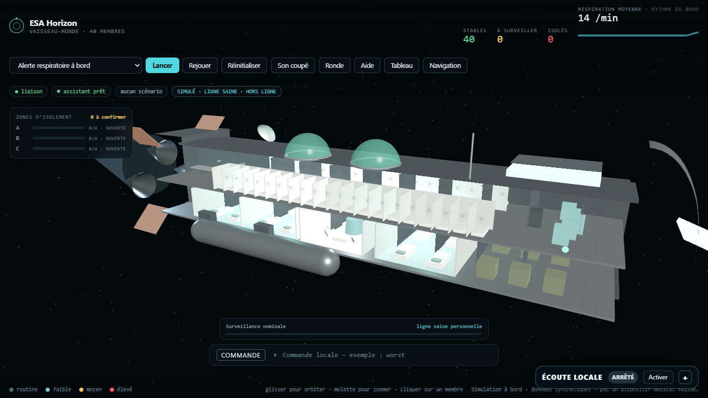
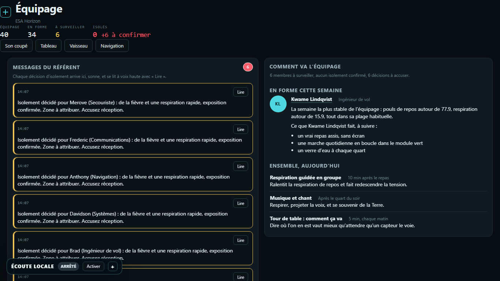
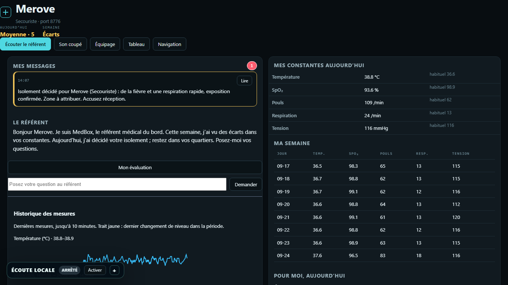

# MedBox — la station médicale d’un vaisseau sans médecin

**Quarante membres d’équipage, aucun médecin, aucun contact avec la Terre.**
MedBox mesure tout le monde en continu, calcule une priorité par des règles que
vous pouvez relire, décide qui isoler, l’explique à la personne et à l’équipage,
et le dit à voix haute. Tout tourne sur un portable, sans réseau.

Workshop National EPSI B3 2026 — *Horizon 2080* — pilier HumanTech &amp;
HealthTech Spatiales, projet **1A**. Le projet **1B** de l’équipage,
ARIA / PsychoSpace, est dans [ANTHONYSITCH/Psychospace](https://github.com/ANTHONYSITCH/Psychospace).

| | |
|---|---|
|  |  |
| *Le vaisseau, ouvert côté public : deux ponts, quarante cabines, l’infirmerie, les trois zones d’isolement.* | *L’équipage : messages du référent, membre en forme, activités du jour.* |
|  | |
| *L’espace personnel de Merove pendant la contamination.* | |

---

## Sommaire

1. [Lancer MedBox](#1-lancer-medbox)
2. [Ce que vous voyez](#2-ce-que-vous-voyez)
3. [Documentation : où lire quoi](#3-documentation--où-lire-quoi)
4. [Comment c’est construit](#4-comment-cest-construit)
5. [Ce que le référent ne peut pas faire](#5-ce-que-le-référent-ne-peut-pas-faire)
6. [Les chiffres](#6-les-chiffres)
7. [Scénarios](#7-scénarios)
8. [API](#8-api)
9. [Tests](#9-tests)
10. [Structure du dépôt](#10-structure-du-dépôt)
11. [L’équipage](#11-léquipage)

---

## 1. Lancer MedBox

### Le dossier portable (la façon de la soutenance)

Un dossier `MedBox-Portable` de 1,6 Go contient tout : Python, Ollama et le
modèle, les modèles de voix, les pages, les outils. Double-cliquez `MedBox.exe`.
La station est prête en quatre secondes, le modèle chaud en moins d’une minute,
six espaces personnels ouverts. Aucun accès réseau. Comment le construire et le
vérifier : [`packaging/README.md`](packaging/README.md) et
[`packaging/LISEZ-MOI.txt`](packaging/LISEZ-MOI.txt).

Avant une démonstration : `tools\preflight.ps1` (ports libres, modèle, voix).
Pour le moment de panne : `tools\assistant.ps1 stop`, puis `start`.

### Depuis les sources

**Windows**
```powershell
powershell -ExecutionPolicy Bypass -File setup.ps1
.\.venv\Scripts\python medbox.py
```

**Linux / macOS**
```bash
./setup.sh
.venv/bin/python medbox.py
```

Puis ouvrez <http://127.0.0.1:8765>. `setup` crée l’environnement, installe les
dépendances, installe et vérifie Ollama, télécharge le modèle, crée la base et
lance les tests ; il peut être relancé à tout moment. Sur Windows, Ollama est
un installateur de 1,2 Go : `setup` demande avant de le télécharger (répondez
d’avance avec `-y` : `powershell -ExecutionPolicy Bypass -File setup.ps1 -y`),
puis se relance une seconde fois pour tirer le modèle. Sans réseau :
`python setup.py --no-ollama` ; tout fonctionne sauf le référent.

**La voix.** La station parle sans rien installer (les phrases sont dans le
dépôt). Pour qu’elle écoute, récupérez une fois le modèle de reconnaissance :
`.\.venv\Scripts\python tools\assets.py` (ou `--from D:\...` depuis une clé).
Le bouton micro reste masqué tant que le modèle n’est pas complet.

## 2. Ce que vous voyez

| Page | Adresse | Ce qu’elle fait |
|---|---|---|
| Vaisseau 3D | `/ship` | Le vaisseau vu de trois quarts, la coque ouverte comme une maison de poupée : deux ponts, quarante cabines, l’infirmerie, les trois zones d’isolement et leurs couchettes, les moteurs ; commande locale ; micro ; « Ronde ». |
| Tableau | `/board` | Le tableau 2D de surveillance, classé par priorité, avec le dossier de chaque membre. |
| Équipage | `/crew` | La semaine des six, l’état de chacun, le membre en forme et ses habitudes, les activités du jour, les messages du référent. |
| Espace personnel | `/me/P-01` … `/me/P-06`, ports **8771 à 8776** | Le référent reconnaît la personne, se présente, lit son évaluation à la deuxième personne, répond à ses questions ; sa semaine, ses messages, son dossier, le vaisseau centré sur elle. |

Sept serveurs démarrent ensemble : la station sur 8765 et un serveur par membre.
Chaque page a le menu Navigation, le micro et la voix.

**Parler à la station.** Dites « j’accepte » quand elle demande le consentement,
puis « MedBox » (ou le nom que vous avez donné à votre assistant) suivi de la
demande : « montre la zone A », « ronde », « qui est en isolement ? », « est-ce
que je vais bien ? ». Le micro attend la fin de votre phrase avant de transcrire.

## 3. Documentation : où lire quoi

| Vous voulez… | Lisez |
|---|---|
| Utiliser la station : chaque fonction, ce qu’elle fait, ce qu’elle refuse, comment la déclencher | [`docs/USER_GUIDE.md`](docs/USER_GUIDE.md) — le guide de l’opérateur, généré depuis le produit par `tools/guide.py` ; un test échoue si le guide promet ce que le code ne fait pas |
| Comprendre MedBox sans être technicien : pourquoi deux chemins, pourquoi NEWS2, « il se prend pour un médecin ? » | [`docs/COMPRENDRE-MEDBOX.md`](docs/COMPRENDRE-MEDBOX.md) |
| Le dossier technique et la présentation de l’équipage (deux solutions), et comment les régénérer | [`docs/dossier/NOTE-POUR-LE-DOSSIER.md`](docs/dossier/NOTE-POUR-LE-DOSSIER.md), [`tools/build_dossier.py`](tools/build_dossier.py), [`tools/build_deck.py`](tools/build_deck.py) |
| Répéter la démonstration : chaque effet, le geste qui le déclenche, ce qui doit se passer | [`docs/CAHIER-DE-SOUTENANCE.md`](docs/CAHIER-DE-SOUTENANCE.md) |
| Le pitch de cinq minutes | [`docs/pitch.md`](docs/pitch.md) |
| Le dossier patient, les contacts, les scénarios de Brad | [`docs/DEV2_DELIVERY.md`](docs/DEV2_DELIVERY.md) |
| Construire, vérifier et lancer le dossier portable | [`packaging/README.md`](packaging/README.md), [`packaging/LISEZ-MOI.txt`](packaging/LISEZ-MOI.txt) |
| Le barème NEWS2 tel qu’il est codé | [`server/triage.py`](server/triage.py) |
| Ce que le référent sait faire et ce qu’il refuse, à la source | [`server/ai/capabilities.py`](server/ai/capabilities.py) |
| Les scénarios rejouables | [`scenarios/`](scenarios/) |
| La passation technique : décisions, pièges de la machine, ce qui reste à faire | [`CLAUDE.md`](CLAUDE.md) |
| Qui a fait quoi | [`tasks/README.md`](tasks/README.md) |

## 4. Comment c’est construit

**Une seule décision commande tout le reste : le modèle ne touche jamais une
mesure.** Deux chemins tournent côte à côte.

| | Chemin rapide | Chemin lent |
|---|---|---|
| **Fait** | capteurs → score NEWS2 → isolement → écran | évaluation nommée, décision expliquée, réponses, messages |
| **Cadence** | dix fois par seconde, à chaque mesure | quelques secondes, à la demande |
| **Modèle** | aucun, nulle part | Ollama, réponse sous schéma JSON, validateur derrière |
| **S’il tombe** | il ne tombe pas : il n’a pas de dépendance | la voix du référent s’arrête, rien d’autre |

Arrêtez Ollama en pleine consultation : les constantes continuent, le classement
tient, l’isolement fonctionne, la session s’enregistre. La règle qui garde cela
vrai : rien dans `server/triage.py`, `server/sensors/`, `server/quarantine.py`,
`server/bus.py` ou `server/db.py` n’importe `server/ai/`. Un test le vérifie.

**La priorité est NEWS2, pas une invention.** `server/triage.py` reprend le
National Early Warning Score 2 (Royal College of Physicians, 2017) : des points
par constante selon son écart, une somme, un niveau. Cinq paramètres sont
mesurés (température, SpO₂, pouls, respiration, tension), deux sont saisis
(conscience, oxygène d’appoint) ; chaque résultat dit ce qui a été mesuré et le
score est marqué comme un dépistage partiel.

**Le référent médical du bord.** Un modèle léger (`qwen2.5:1.5b-instruct`, Ollama,
processeur seul) ne reçoit que des faits écrits par la station et doit répondre
dans une forme imposée ; un validateur relit chaque phrase. Les questions sur
l’isolement et sur l’équipage sont répondues par la station elle-même, en
millisecondes, à partir de ses registres. Pendant qu’une réponse arrive, le
référent affiche et dit ce qu’il fait.

**La voix, dans les deux sens, hors ligne.** faster-whisper pour écouter (FR et
EN, fin de phrase détectée), Piper pour parler (une voix française, une voix
anglaise). Consentement parlé et révocable ; rien de l’audio n’est conservé.

**Le vaisseau et ses pièces.** Un vaisseau-monde : une coque de trente unités
avec deux ponts, dessinée depuis un seul plan (`web/layout.js`) que la vue 3D et
le tracé technique partagent. Le pont haut porte la passerelle, quarante cabines
et le mess ; le pont bas l’infirmerie et les trois zones d’isolement, quatre
couchettes chacune. Le flanc qui fait face à la caméra est ôté, et le pont du
dessus s’efface quand une pièce du pont bas est regardée. Un membre isolé glisse
dans sa couchette ; un score à sept ou plus le conduit à l’infirmerie. La caméra
entre dans une pièce, un panneau dit qui s’y trouve et comment il va, le
référent le décrit ; « Ronde » fait le tour du vaisseau.

## 5. Ce que le référent ne peut pas faire

- **Décider du score.** Le score et la proposition d’isolement viennent de règles explicites.
- **Prescrire.** Aucun médicament, aucune dose ne passe le validateur.
- **Inventer.** Une condition n’est nommée que si les mesures la montrent ; un isolé n’existe que dans les registres de la station.
- **Décider seul.** Confirmation et levée d’isolement sont humaines.
- **Tomber en silence.** Si le modèle s’arrête, la surveillance continue et l’écran le dit.

MedBox est un prototype de simulation : les mesures sont synthétiques et le
disent ; ce n’est pas un dispositif médical validé.

## 6. Les chiffres

| | |
|---|---|
| Membres suivis | 40, dont 6 réels avec une semaine de mesures en base |
| Cadence | 10 mesures par seconde et par membre |
| Pages / serveurs | 4 pages, 7 serveurs (station + 6 espaces personnels) |
| Scénarios | 9, écrits en écarts par rapport à la ligne de base |
| Tests | 407 réussis, 3 ignorés, 1 échec attendu (la levée automatique, non retenue) |
| Dossier portable | 1,6 Go, 3 791 fichiers vérifiés par SHA-256, lancement en 4 s |
| Réponse du référent | instantanée quand la station répond ; 9 à 14 s quand le modèle formule |

## 7. Scénarios

Un scénario est une chronologie appliquée à l’équipage simulé, en écarts par
rapport à la ligne de base personnelle de chacun. Le même fichier sert à la
démonstration et aux tests.

```bash
curl -X POST http://127.0.0.1:8765/api/scenario/contamination
```

| Scénario | Ce qui se passe |
|---|---|
| `contamination` | Six membres sur quarante se dégradent en quatre-vingt-dix secondes : le scénario du cahier des charges. |
| `single-patient` | Une consultation : un membre, des mesures qui évoluent, les questions du référent. |
| `slow-burn` | Une dégradation lente sur dix minutes ; le score monte cran par cran. |
| `false-alarm` | Une fièvre seule après l’effort : surveillance, pas d’isolement. |
| `baisse-thermique` · `effort-prolonge` · `exposition-environnementale` · `gene-respiratoire` · `signes-pseudo-grippaux` | Les situations du bord, une par fichier, dans [`scenarios/`](scenarios/). |

Démontrez toujours depuis un scénario, jamais depuis des capteurs en direct : un
rejeu répété ne surprend personne devant un jury.

## 8. API

| Route | Rôle |
|---|---|
| `GET /api/status` | version, état du modèle, des oreilles et de la voix, ports personnels |
| `GET /api/board` | le tableau complet avec le score de chacun |
| `GET /api/patient/{id}` | un membre, son historique, ses réponses, ses contacts |
| `GET /api/crew/week` | la semaine de l’équipage, le membre en forme, les activités |
| `GET /api/me/{id}` | l’espace personnel : présentation, semaine, messages |
| `GET /api/messages` · `POST /api/messages/{id}/read` | les messages du référent ; « Lire » |
| `POST /api/scenario/{name}` · `POST /api/scenario/stop` | lancer un scénario ; revenir au nominal |
| `POST /api/assess/{id}` | l’évaluation du référent (503 quand le modèle est arrêté, exprès) |
| `POST /api/assistant/ask` | une question en texte ; la station répond elle-même sur l’isolement et l’équipage |
| `POST /api/voice/say` | faire parler la station (Piper, fr ou en) |
| `POST /api/quarantine/{id}/confirm` · `/release` | confirmer, lever : des décisions humaines |
| `GET /api/interconnect/health` | la santé du bord pour les autres systèmes du vaisseau, sans nom ni mesure individuelle |
| `WS /ws` | la télémétrie en direct, dix fois par seconde |

## 9. Tests

```powershell
.\.venv\Scripts\python -m pytest tests\ -q
```

```bash
.venv/bin/python -m pytest tests/ -q
```

Les tests de triage comptent plus qu’ils n’en ont l’air : le score est ce que le
jury voit et ce qui commande l’isolement. D’autres tests vérifient que le chemin
rapide n’importe jamais le modèle, que le guide ne promet rien que le code ne
fait pas, que le dossier portable ne voit pas la machine hôte, et que le
référent n’invente pas un isolé.

## 10. Structure du dépôt

```
medbox.py              point d’entrée — la station et les six espaces personnels
setup.py / setup.ps1   installation (Windows et Linux), relançable
config.toml            tout ce qui se configure, en un fichier

server/
  app.py               FastAPI : API, WebSocket, pages, messages, espaces
  triage.py            NEWS2 — fonctions pures, aucune entrée-sortie      [RAPIDE]
  quarantine.py        zones, couchettes, contacts, confirmation humaine   [RAPIDE]
  bus.py               diffusion vers chaque écran                         [RAPIDE]
  db.py                SQLite : membres, mesures, semaine, messages        [RAPIDE]
  sensors/             équipage synthétique et tête de mesure série        [RAPIDE]
  ai/                  client Ollama, schémas, validateur, capacités       [LENT]
  spoken.py, tts.py, voice.py, speech.py   la voix : phrases, Piper, faster-whisper
  personal.py          un serveur par membre
  activities.py        activités du jour et habitudes

web/                   les pages : vaisseau (WebGL), tableau, équipage, espace ; micro, voix, réflexion
scenarios/             les neuf chronologies
tests/                 pytest
tools/                 guide, dossier, deck, bundle portable, contrôle avant soutenance
packaging/             le dossier portable Windows
docs/                  guide de l’opérateur, comprendre MedBox, dossier, pitch
```

## 11. L’équipage

| | Projet | Périmètre |
|---|---|---|
| **Eddy** | 1A MedBox | Direction ; vues 2D/3D et vue par pièce ; référent médical ; voix ; équipage et espaces personnels ; messages et cartes ; dossier portable ; tests ; dossier et présentation. |
| **Brad** | 1A MedBox | Dossier patient persistant, historique de priorité, contacts, sessions ; scénarios `slow-burn` et `false-alarm` ; règles de quarantaine ; premier dossier technique. |
| **Davidson, Anthony, Frederic, Merove** | 1B ARIA / PsychoSpace | Conception et développement d’ARIA : orchestration FastAPI, base documentaire locale, suivi du bien-être et dérive, interface de mission — [ANTHONYSITCH/Psychospace](https://github.com/ANTHONYSITCH/Psychospace). |
